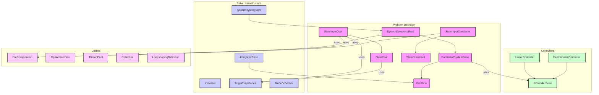

# OCS2 Core Package Analysis

## 1. 实现功能与关系

`ocs2_core` 是 OCS2 (Optimal Control for Switched Systems) 库的核心包，它提供了最优控制问题定义、求解所需的基础组件和接口。这个包不包含任何具体的求解器实现，而是定义了构成一个最优控制问题的各个要素，例如系统动力学、代价函数、约束等。它还提供了数值积分、自动微分、线性代数工具、多线程支持等一系列基础功能。

### 1.1. 核心组件

`ocs2_core` 包主要由以下几个核心组件构成：

- **系统动力学 (Dynamics)**: 定义了系统的连续（flow map）和离散（jump map）动态行为。
- **代价函数 (Cost)**: 定义了最优控制问题的性能指标。
- **约束 (Constraint)**: 定义了系统需要满足的等式或不等式约束。
- **控制器 (Control)**: 定义了控制策略的接口和具体实现（如线性反馈控制器）。
- **数值积分 (Integration)**: 提供了多种数值积分方法来仿真系统动态。
- **自动微分 (Automatic Differentiation)**: 提供了基于 CppAD 的自动微分工具和有限差分法来计算导数。
- **数据结构 (Data Structures)**: 定义了整个库中使用的数据类型，如向量、矩阵、轨迹以及用于存储模型数据的结构体。

### 1.2. 组件关系 (Mermaid)

### 1.3. 文字表述节点关系

- **问题定义 (Problem Definition)**:
    - `SystemDynamicsBase` (系统动力学) 继承自 `ControlledSystemBase`，后者又继承自 `OdeBase`。这个层次结构从最基础的常微分方程 (`OdeBase`)，到由控制器驱动的系统 (`ControlledSystemBase`)，再到包含线性化功能的完整系统动力学定义 (`SystemDynamicsBase`)。
    - `StateInputCost` (状态-输入代价) 和 `StateCost` (仅状态代价) 是代价函数的基类。
    - `StateInputConstraint` (状态-输入约束) 和 `StateConstraint` (仅状态约束) 是约束的基类。
    - 这些组件都可以使用 `PreComputation` 模块来共享计算，避免重复工作。代价函数通常需要 `TargetTrajectories` (目标轨迹) 来计算误差。

- **求解器基础设施 (Solver Infrastructure)**:
    - `IntegratorBase` (积分器) 用于对 `OdeBase` 定义的系统进行数值积分，以仿真系统轨迹。
    - `SensitivityIntegrator` (敏感度积分器) 不仅对系统进行积分，还计算离散化后系统动力学的线性化模型，这是求解最优控制问题的关键步骤。
    - `Initializer` (初始化器) 为求解器提供状态和输入的初始猜测。
    - `TargetTrajectories` (目标轨迹) 和 `ModeSchedule` (模式调度) 为求解器提供了参考信息和系统的模式切换信息。

- **控制器 (Controllers)**:
    - `ControllerBase` 是所有控制器的基类接口。
    - `LinearController` 和 `FeedforwardController` 是两种具体的控制器实现，分别代表线性反馈控制和前馈控制。
    - `ControlledSystemBase` 使用 `ControllerBase` 来计算控制输入，从而驱动系统。

- **工具 (Utilities)**:
    - `PreComputation` 是一个可选模块，用于在动力学、代价和约束之间共享计算结果。
    - `CppAdInterface` 提供了强大的自动微分功能，是计算导数的核心工具之一。
    - `ThreadPool` 提供了多线程支持，用于并行化计算。
    - `Collection` 是一个模板类，用于管理一组具有名称的对象，例如多个代价项或约束项。
    - `LoopshapingDefinition` 定义了环路整形的相关参数，这是一种用于提升系统鲁棒性的控制技术。

## 2. 各节点方法功能说明

### `ocs2_core` 顶层头文件

- **`Types.h`**: 定义了整个库的基础数据类型，大部分基于 `Eigen` 和 `std::vector`。
    - `scalar_t`, `vector_t`, `matrix_t`: 标量、向量和矩阵类型。
    - `scalar_array_t`, `vector_array_t`, `matrix_array_t`: 相应类型的轨迹（时间序列）。
    - `ScalarFunctionLinearApproximation`, `ScalarFunctionQuadraticApproximation`: 标量函数的线性和二次近似，用于代价函数。
    - `VectorFunctionLinearApproximation`, `VectorFunctionQuadraticApproximation`: 向量函数的线性和二次近似，用于动力学和约束。
- **`PreComputation.h`**:
    - `PreComputation`: 这是一个基类，用于在动力学、代价和约束的计算之间共享中间结果。
        - `request()`: 在计算值或近似之前被调用，用于触发预计算。
- **`ComputationRequest.h`**:
    - `Request`, `RequestSet`: 定义了计算请求的类型（如 `Dynamics`, `Cost`, `Constraint`），允许按需计算，提高效率。
- **`NumericTraits.h`**: 定义了用于浮点数比较的数值精度。

### `cost` 目录

- **`StateCost.h` / `StateInputCost.h`**: 代价函数的抽象基类。
    - `getValue()`: 计算给定时间、状态（和输入）下的代价值。
    - `getQuadraticApproximation()`: 计算代价函数的二次近似（Hessian, Gradient, and value）。
- **`QuadraticStateCost.h` / `QuadraticStateInputCost.h`**: 实现了二次型代价函数。
- **`StateCostCollection.h` / `StateInputCostCollection.h`**: 将多个代价项组合成一个总的代价函数。
- **`StateCostCppAd.h` / `StateInputCostCppAd.h`**: 使用 CppAD 自动微分来计算代价函数导数的基类。

### `constraint` 目录

- **`StateConstraint.h` / `StateInputConstraint.h`**: 约束的抽象基类。
    - `getNumConstraints()`: 返回约束向量的维度。
    - `getValue()`: 计算约束向量的值（对于等式约束，值为0表示满足；对于不等式约束，值<=0表示满足）。
    - `getLinearApproximation()` / `getQuadraticApproximation()`: 计算约束函数的线性或二次近似。
- **`LinearStateConstraint.h` / `LinearStateInputConstraint.h`**: 实现了线性约束。
- **`StateConstraintCollection.h` / `StateInputConstraintCollection.h`**: 将多个约束项组合起来。
- **`StateConstraintCppAd.h` / `StateInputConstraintCppAd.h`**: 使用 CppAD 自动微分来计算约束导数的基类。

### `dynamics` 目录

- **`OdeBase.h`**: 常微分方程 (ODE) 的基类。
    - `computeFlowMap()`: 计算连续系统动态 \f$ \dot{x} = f(t, x) \f$。
    - `computeJumpMap()`: 计算离散跳变 \f$ x^+ = g(t, x) \f$。
    - `computeGuardSurfaces()`: 计算触发跳变的保护面函数。
- **`ControlledSystemBase.h`**: 继承自 `OdeBase`，增加了控制器。
    - `setController()`: 设置用于计算控制输入的控制器。
    - `computeFlowMap(t, x, u, ...)`: 计算包含控制输入的系统动态。
- **`SystemDynamicsBase.h`**: 继承自 `ControlledSystemBase`，增加了线性化功能。
    - `linearApproximation()`: 计算系统动态的线性化模型 (A, B 矩阵)。
    - `jumpMapLinearApproximation()`: 计算跳变映射的线性化模型。
- **`SystemDynamicsBaseAD.h`**: 使用 CppAD 自动计算 `SystemDynamicsBase` 的线性化模型。
- **`SystemDynamicsLinearizer.h`**: 使用有限差分法计算 `SystemDynamicsBase` 的线性化模型。

### `control` 目录

- **`ControllerBase.h`**: 所有控制器的抽象基类。
    - `computeInput()`: 根据当前时间和状态计算控制输入。
    - `concatenate()`: 连接两个控制器，用于分段控制器。
- **`LinearController.h`**: 实现了时变的线性反馈控制器 \f$ u(t, x) = K(t) x + k(t) \f$。
- **`FeedforwardController.h`**: 实现了时变的前馈控制器 \f$ u(t) \f$。

### `integration` 目录

- **`IntegratorBase.h`**: 数值积分器的基类。
    - `integrateConst()`: 定步长积分。
    - `integrateAdaptive()`: 变步长积分。
    - `integrateTimes()`: 在指定时间点序列上积分。
- **`SensitivityIntegrator.h`**: 用于计算离散化动力学及其敏感度（线性化）的函数句柄。
    - `selectDynamicsDiscretization()`: 选择离散化方法 (Euler, RK2, RK4)。
    - `selectDynamicsSensitivityDiscretization()`: 选择计算敏感度的方法。

### `initialization` 目录

- **`Initializer.h`**: 初始化器的基类，为求解器提供初始轨迹。
    - `compute()`: 计算给定当前状态和时间下的下一个状态和输入。
- **`DefaultInitializer.h`**: 一个简单的实现，将输入设为零，状态保持不变。
- **`OperatingPoints.h`**: 使用预设的轨迹点作为初始值。

### `reference` 目录

- **`TargetTrajectories.h`**: 存储最优控制问题要跟踪的目标轨迹（时间、状态、输入）。
- **`ModeSchedule.h`**: 定义了混合系统的模式序列和切换时间。

### 其他重要目录

- **`augmented_lagrangian`**: 实现了增广拉格朗日方法，用于处理等式和不等式约束。
- **`automatic_differentiation`**: 提供了 `CppAdInterface`，一个封装了 CppAD 库的强大接口，用于高效的自动微分。
- **`loopshaping`**: 实现了环路整形技术，通过为系统增加滤波器来改善其鲁棒性。
- **`misc`**: 包含各种工具类，如 `Collection` (用于管理代价/约束项)、`LinearInterpolation` (线性插值)、`LoadData` (从文件加载数据) 等。
- **`model_data`**: 定义了 `ModelData` (存储单个时间点的模型近似)、`Metrics` (存储性能指标) 和 `Multiplier` (存储拉格朗日乘子) 等数据结构。
- **`penalties`**: 提供了多种惩罚函数（如二次惩罚、松弛屏障惩罚），用于软约束和增广拉格朗日方法。
- **`soft_constraint`**: 将硬约束转化为软约束（即代价项）的实现。
- **`thread_support`**: 提供了 `ThreadPool` 等多线程编程工具，用于加速计算。

## 3. 应当说明的内容

- **模板化和通用性**: `ocs2_core` 在设计上高度模板化和通用。通过抽象基类和接口，用户可以方便地为自己的特定系统实现动力学、代价和约束，而无需关心求解器内部的复杂细节。
- **效率考量**: 多个设计都体现了对计算效率的考量。例如，`PreComputation` 机制避免了重复计算；`ComputationRequest` 允许按需计算；`CppAdInterface` 通过代码生成和编译提供了非常高效的导数计算。
- **混合系统支持**: 通过 `ModeSchedule`、`computeJumpMap` 和 `computeGuardSurfaces` 等机制，`ocs2_core` 对具有离散事件的混合系统提供了一流的支持。
- **鲁棒性设计**: `loopshaping` 模块的引入，使得用户可以在最优控制框架内系统地进行鲁棒控制器设计。
- **约束处理的多样性**: `ocs2_core` 提供了多种约束处理方法，包括硬约束（通过求解器内部处理）、软约束（转化为代价项）和增广拉格朗日方法，为用户提供了灵活性。
