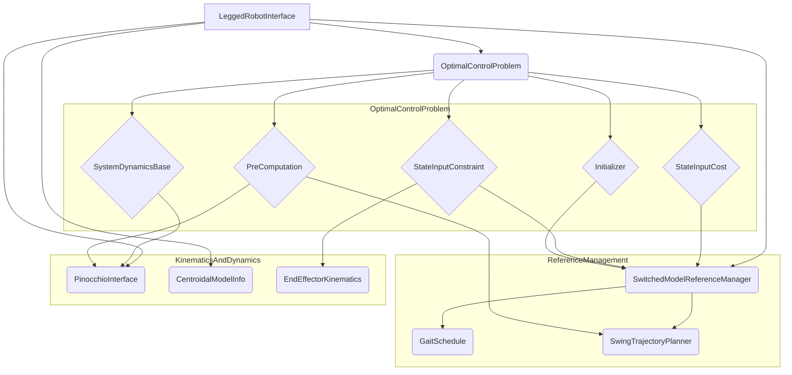

# ocs2_legged_robot

## 概述

`ocs2_legged_robot` 包是 `ocs2` 框架中针对腿式机器人应用的实现。它提供了一个完整的框架，用于定义腿式机器人的最优控制问题，包括动力学、约束、代价函数、步态规划和状态初始化等。该包利用 `ocs2_centroidal_model` 来描述机器人的动力学，并使用 `Pinocchio` 库进行运动学和动力学计算。

该包的核心是 `LeggedRobotInterface` 类，它继承自 `RobotInterface`，并负责组装最优控制问题的所有组件。

## 文件结构

`ocs2_legged_robot` 包的主要代码位于 `include/ocs2_legged_robot` 和 `src` 目录下，其结构如下：

- **common**: 包含模型设置、类型定义和通用工具函数。
- **constraint**: 定义了腿式机器人的各种约束，如摩擦锥约束、零力约束和零速度约束。
- **cost**: 定义了代价函数，主要用于跟踪期望的基座轨迹。
- **dynamics**: 包含了腿式机器人的动力学模型，使用自动微分进行求导。
- **foot_planner**: 实现了足端摆动轨迹的规划。
- **gait**: 定义了步态相关的逻辑，包括步态调度和模式序列模板。
- **initialization**: 实现了机器人的状态初始化。
- **reference_manager**: 管理参考轨迹和模式调度。

## 节点关系

`ocs2_legged_robot` 包本身不直接作为 ROS 节点运行，而是作为一个库，被 `ocs2_legged_robot_ros` 等包调用。其核心类之间的关系可以用 Mermaid 图表示如下：

**节点关系文字描述:**

- `LeggedRobotInterface` 是核心接口类，它创建并持有一个 `OptimalControlProblem` 对象。
- `OptimalControlProblem` 包含了最优控制问题的所有组成部分，包括动力学 (`SystemDynamicsBase`)、代价 (`StateInputCost`)、约束 (`StateInputConstraint`)、预计算 (`PreComputation`) 和初始化器 (`Initializer`)。
- `LeggedRobotInterface` 还管理着 `PinocchioInterface`（用于运动学和动力学计算）、`CentroidalModelInfo`（描述质心模型）和 `SwitchedModelReferenceManager`（用于参考轨迹和模式管理）。
- `SwitchedModelReferenceManager` 内部使用 `GaitSchedule` 和 `SwingTrajectoryPlanner` 来生成步态和足端轨迹。
- 动力学、约束、代价等模块都依赖于 `PinocchioInterface`、`CentroidalModelInfo` 和 `SwitchedModelReferenceManager` 提供的信息。
- `EndEffectorKinematics` 用于计算末端执行器（足端）的运动学，并被约束模块使用。

## 主要方法功能说明

### LeggedRobotInterface

`LeggedRobotInterface` 是设置腿式机器人最优控制问题的核心类。

- **`LeggedRobotInterface(const std::string& taskFile, const std::string& urdfFile, const std::string& referenceFile, bool useHardFrictionConeConstraint)`**: 构造函数，从配置文件中加载所有参数，并初始化最优控制问题。
- **`setupOptimalConrolProblem(const std::string& taskFile, const std::string& urdfFile, const std::string& referenceFile, bool verbose)`**: 核心的私有方法，用于设置 `OptimalControlProblem` 的所有组件，包括动力学、代价、约束等。
- **`getOptimalControlProblem()`**: 返回构建好的 `OptimalControlProblem` 对象。
- **`getInitializer()`**: 返回初始化器 `LeggedRobotInitializer`。
- **`getReferenceManagerPtr()`**: 返回参考管理器 `SwitchedModelReferenceManager`。

### Dynamics

- **`LeggedRobotDynamicsAD`**: 使用 `PinocchioCentroidalDynamicsAD` 实现，通过自动微分计算动力学模型的导数。
  - **`computeFlowMap(...)`**: 计算系统的状态导数。
  - **`linearApproximation(...)`**: 计算动力学模型的线性化近似。

### Constraint

- **`EndEffectorLinearConstraint`**: 对末端执行器的位置和速度施加线性约束的基类。
- **`FrictionConeConstraint`**: 实现摩擦锥约束，确保足端接触力在摩擦锥内。
- **`ZeroForceConstraint`**: 对处于摆动相的足端施加零力约束。
- **`ZeroVelocityConstraintCppAd`**: 对处于支撑相的足端施加零速度约束，使用 CppAd 进行自动微分。
- **`NormalVelocityConstraintCppAd`**: 对处于摆动相的足端在垂直于地面的方向上施加速度约束，用于轨迹跟踪，使用 CppAd 进行自动微分。

### Cost

- **`LeggedRobotStateInputQuadraticCost`**: 二次型代价函数，用于惩罚状态和输入与期望值的偏差。
- **`LeggedRobotStateQuadraticCost`**: 终端代价函数，只惩罚最终状态与期望值的偏差。

### Foot Planner

- **`CubicSpline` / `SplineCpg`**: 用于生成平滑的足端摆动轨迹的样条曲线。
- **`SwingTrajectoryPlanner`**: 根据步态调度，为每个摆动相的足生成期望的轨迹。
  - **`update(...)`**: 根据新的模式调度更新足端轨迹。
  - **`getZvelocityConstraint(...)` / `getZpositionConstraint(...)`**: 获取指定时间和腿的足端在 Z 轴上的速度和位置约束。

### Gait

- **`Gait` / `GaitSchedule`**: 定义和管理步态序列。`Gait` 描述了一个周期性的步态，而 `GaitSchedule` 则将多个 `Gait` 组合成一个完整的模式调度。
- **`ModeSequenceTemplate`**: 从文件中加载步态序列模板。
- **`LegLogic`**: 提供了一系列工具函数，用于从模式调度中提取与腿相关的逻辑，如接触时间、摆动时间等。

### Initialization

- **`LeggedRobotInitializer`**: 实现了 `Initializer` 接口，用于在每次 MPC 迭代开始时，根据当前状态和参考轨迹，计算一个合适的初始输入和下一个状态。

### Reference Manager

- **`SwitchedModelReferenceManager`**: 继承自 `ReferenceManager`，专门用于腿式机器人这种切换模型。它管理着 `GaitSchedule` 和 `SwingTrajectoryPlanner`，并根据它们生成模式调度和目标轨迹。
  - **`modifyReferences(...)`**: 在每次 MPC 更新时，根据当前的步态调度和摆动腿轨迹，修改参考轨迹和模式调度。
  - **`getContactFlags(...)`**: 获取在指定时间的接触状态。

## 总结

`ocs2_legged_robot` 包为腿式机器人的运动控制提供了一个功能强大且高度可配置的框架。它通过将复杂的运动控制问题分解为动力学、约束、代价、步态等多个模块，实现了代码的解耦和复用。其核心是 `LeggedRobotInterface`，它将所有这些模块有机地组织在一起，构成一个完整的 dla 最优控制问题。该包的设计充分利用了 OCS2 框架的优势，并通过与 `Pinocchio` 和 `CppAd` 等库的结合，实现了高效、精确的运动学和动力学计算。
