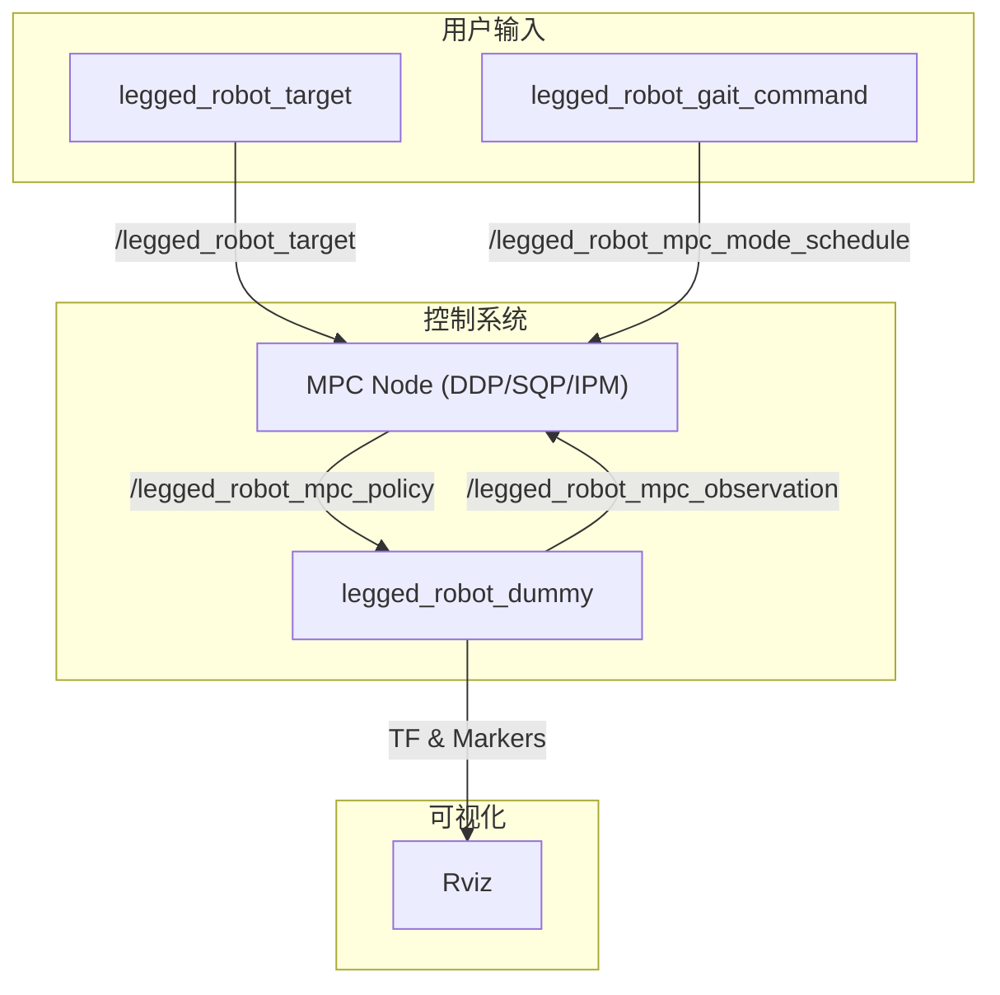

# ocs2_legged_robot_ros

## 概述

`ocs2_legged_robot_ros` 包是 `ocs2_legged_robot` 的 ROS 接口层。它负责将 `ocs2_legged_robot` 包中实现的 MPC 控制器与 ROS 环境集成，提供了节点、可视化、以及通过 ROS 话题和服务进行交互的能力。

该包主要包含以下功能：
- **MPC 节点**: 提供了三种不同求解器（DDP, SQP, IPM）的 MPC 节点。
- **仿真节点**: 一个用于模拟机器人行为的虚拟节点。
- **指令节点**: 用于通过键盘发送目标位姿和步态指令。
- **可视化**: 在 Rviz 中可视化机器人的状态、期望轨迹、足端力等。

## 节点关系

`ocs2_legged_robot_ros` 包中的节点通过 ROS 话题和服务进行交互，构成一个完整的控制系统。

**节点关系文字描述:**

1.  **指令节点**:
    *   `legged_robot_target`: 一个键盘输入节点，用于发布目标轨迹（`ocs2_msgs/mpc_target_trajectories`）到 `/legged_robot_target` 话题。
    *   `legged_robot_gait_command`: 一个键盘输入节点，用于发布步态指令（`ocs2_msgs/mode_schedule`）到 `/legged_robot_mpc_mode_schedule` 话题。

2.  **控制系统**:
    *   **MPC 节点** (`legged_robot_ddp_mpc`, `legged_robot_sqp_mpc`, `legged_robot_ipm_mpc`):
        *   订阅 `/legged_robot_mpc_observation` 话题，获取当前机器人状态。
        *   订阅 `/legged_robot_target` 话题，获取目标轨迹。
        *   订阅 `/legged_robot_mpc_mode_schedule` 话题，获取步态指令。
        *   运行 MPC 优化，计算出最优的控制策略。
        *   发布最优控制策略（`ocs2_msgs/mpc_flattened_controller`）到 `/legged_robot_mpc_policy` 话题。
    *   **`legged_robot_dummy`**:
        *   一个仿真节点，模拟机器人的行为。
        *   订阅 `/legged_robot_mpc_policy` 话题，获取并执行 MPC 计算出的控制策略。
        *   发布机器人的当前状态（`ocs2_msgs/mpc_observation`）到 `/legged_robot_mpc_observation` 话题。
        *   通过 `LeggedRobotVisualizer` 发布可视化信息到 Rviz。

3.  **可视化**:
    *   **Rviz**: 用于可视化机器人模型、期望轨迹、足端力、支撑多边形等。数据由 `legged_robot_dummy` 节点中的 `LeggedRobotVisualizer` 提供。

## 主要方法功能说明

### MPC 节点 (例如 `LeggedRobotSqpMpcNode.cpp`)

这些节点是 MPC 控制器的 ROS 封装。它们的功能类似，只是使用了不同的求解器。

- **`main()`**:
  - 初始化 ROS 节点。
  - 从参数服务器获取配置文件路径（`taskFile`, `urdfFile`, `referenceFile`）。
  - 创建 `LeggedRobotInterface` 对象，该对象包含了最优控制问题的完整定义。
  - 创建 `GaitReceiver`，用于接收和处理来自 `/legged_robot_mpc_mode_schedule` 的步态指令。
  - 创建 `RosReferenceManager`，用于接收和处理来自 `/legged_robot_target` 的目标轨迹。
  - 创建 MPC 求解器实例（例如 `SqpMpc`）。
  - 将 `GaitReceiver` 和 `RosReferenceManager` 添加到求解器的同步模块中。
  - 创建 `MPC_ROS_Interface` 对象，它负责 MPC 与 ROS 之间的通信。
  - 启动 `MPC_ROS_Interface`。

### `legged_robot_dummy`

该节点模拟机器人的动力学，并与 MPC 节点形成闭环。

- **`main()`**:
  - 初始化 ROS 节点。
  - 创建 `LeggedRobotInterface` 对象。
  - 创建 `MRT_ROS_Interface`，它负责与 MPC 节点进行通信（订阅策略，发布观测值）。
  - 创建 `LeggedRobotVisualizer`，用于发布可视化信息。
  - 创建 `MRT_ROS_Dummy_Loop`，这是仿真的核心，它以指定的频率运行，执行 MPC 策略，并发布新的观测值。
  - 设置初始状态和初始指令。
  - 启动仿真循环。

### 指令节点

- **`LeggedRobotPoseCommandNode.cpp`**:
  - 创建 `TargetTrajectoriesKeyboardPublisher` 对象。
  - 提供一个命令行界面，让用户输入期望的基座平移和旋转，然后将其转换为 `TargetTrajectories` 并发布。
- **`LeggedRobotGaitCommandNode.cpp`**:
  - 创建 `GaitKeyboardPublisher` 对象。
  - 从配置文件加载可用的步态列表。
  - 提供一个命令行界面，让用户选择并发布期望的步态。

### Gait

- **`GaitReceiver`**:
  - 继承自 `SolverSynchronizedModule`，可以在 MPC 求解器运行前后执行特定操作。
  - **`mpcModeSequenceCallback(...)`**: 订阅 `/legged_robot_mpc_mode_schedule` 话题，当接收到新的步态指令时，将其存储起来。
  - **`preSolverRun(...)`**: 在 MPC 求解器每次运行前被调用。如果接收到了新的步态，它会调用 `gaitSchedulePtr_->insertModeSequenceTemplate(...)` 来更新步态调度。
- **`GaitKeyboardPublisher`**:
  - **`getKeyboardCommand()`**: 等待用户通过键盘输入步态指令，然后将其发布为 `ocs2_msgs::mode_schedule` 消息。

### Visualization

- **`LeggedRobotVisualizer`**:
  - **`update(...)`**: 在每次接收到新的观测值和控制策略时被调用，用于更新和发布可视化信息。
  - **`publishObservation(...)`**: 发布机器人的当前状态，包括关节位置、基座姿态、足端位置和力。
  - **`publishDesiredTrajectory(...)`**: 发布期望的基座和足端轨迹。
  - **`publishOptimizedStateTrajectory(...)`**: 发布 MPC 优化出的状态轨迹。
  - **`publishJointTransforms(...)` / `publishBaseTransform(...)`**: 发布 TF 变换，用于在 Rviz 中显示机器人模型。
  - **`publishCartesianMarkers(...)`**: 发布足端位置、接触力、压力中心和支撑多边形等 Marker 信息。

### WBC 说明

总结一下这个例子的架构：

1. **MPC (高层)**: 负责“思考”和“规划”，决定未来一段时间内身体的运动、足端的落点和接触力。它的运行频率较低（例如 mpcDesiredFrequency 设置为 50Hz）。
2. **WBC (底层, 在此例中缺失)**: 负责“执行”，将 MPC 的规划转化为实时的、物理上可行的关节力矩。
3. **仿真节点 (`legged_robot_dummy`)**: 在这个例子中，`legged_robot_dummy` 节点扮演了一个简化的“理想执行器”的角色。它直接接收 MPC 的输出（期望的关节速度和接触力），并假设这些指令可以被完美执行，然后更新机器人的状态。这在算法开发和仿真验证阶段是常见做法，可以暂时忽略底层控制器的复杂性。

---

如果没有 WBC，MPC 的输入输出是什么？

既然没有 WBC，MPC 的“输入”和“输出”就直接定义了它在整个控制回路中的角色。这里的“输入”指的是 MPC 优化问题中的控制输入向量 `u`，“输出”指的是 MPC 求解后得到的最优解 `PrimalSolution`。

#### MPC 的输入 (Input Vector u)

在 `ocs2_legged_robot` 中，MPC 的控制输入向量 `u` 并不是关节力矩。相反，它是一个更高维度的、更抽象的量，主要由两部分组成：

1. **足端接触力 (Contact Forces)**:
   - 对于每个接触点（4 条腿的足端），输入向量中包含了它在世界坐标系下的 [fx, fy, fz] 三个方向的力。
   - 这部分共 4 * 3 = 12 维。
2. **关节速度 (Joint Velocities)**:
   - 对于每个可驱动的关节（ANYmal 机器人有 12 个），输入向量中包含了它的目标角速度。
   - 这部分共 12 维。

因此，整个控制输入向量 `u` 的维度是 12 + 12 = 24 维。MPC 的任务就是找到最优的接触力和关节速度序列。

#### MPC 的输出 (PrimalSolution)

MPC 节点（例如 `legged_robot_sqp_mpc`）在每次优化计算后，输出的不是一个单一的控制指令，而是一个完整的最优解（`PrimalSolution`），这个解描述了未来一段时间内的完整运动规划。它被发布到 `/legged_robot_mpc_policy` 话题上，其主要内容包括：

1. **时间轨迹 (`timeTrajectory_`)**: 规划覆盖的时间点序列。
2. **状态轨迹 (`stateTrajectory_`)**: 优化的状态 `x` 序列。状态 `x` 包括了质心动量、基座位姿和关节角度。
3. **输入轨迹 (`inputTrajectory_`)**: 优化的输入 `u` 序列，也就是我们上面定义的接触力和关节速度的轨迹。
4. **反馈控制器 (`controller_`)**: 除了前馈的输入轨迹外，MPC 还会计算出一个时变的线性反馈增益矩阵 `K`。这使得控制器可以表示为 `u(t) = u_ff(t) - K(t) * (x(t) - x_nominal(t))` 的形式，从而能够对扰动和模型误差进行补偿，增强鲁棒性。

#### 执行流程

`legged_robot_dummy` 节点订阅这个 `PrimalSolution`。在每个控制周期，它会根据当前时间 `t`，从这个解决方案中插值得到当前时刻应该执行的前馈输入 `u_ff(t)`，并结合当前状态 `x(t)` 和反馈增益 `K(t)` 计算出最终的指令，然后用这个指令来更新仿真状态。

## 总结

`ocs2_legged_robot_ros` 包成功地将 `ocs2_legged_robot` 的核心控制算法与 ROS 生态系统集成在一起。它通过一系列定义清晰的 ROS 节点和话题，实现了用户指令输入、MPC 控制、仿真和可视化之间的解耦和通信。这种模块化的设计使得系统的各个部分可以独立开发和测试，同时也为用户提供了一个易于使用和扩展的框架。
