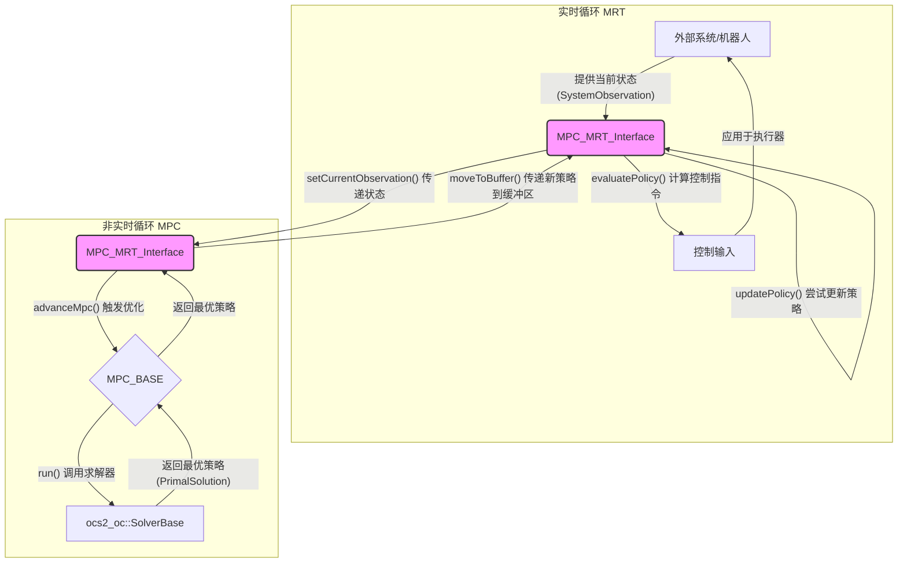

# ocs2_mpc 包分析

## 1. 功能与节点关系

### 1.1. 实现功能

`ocs2_mpc` 包是 OCS2 (Optimal Control for Switched Systems) 框架中实现模型预测控制（MPC）的核心组件。它巧妙地将计算密集型的优化过程与高频率的实时控制过程解耦，以确保系统能够实时响应。

其核心思想是：
1.  **一个非实时线程**：负责执行计算成本高昂的 MPC 优化。它基于系统的当前状态，在一个有限的时间域（horizon）内求解一个最优控制问题，从而生成一个最优的控制策略（Primal Solution）。
2.  **一个实时线程**：负责以高频率运行。它从非实时线程接收最新的最优控制策略，并根据该策略计算出当前时刻应施加到系统上的控制指令。

这种分离的设计模式，即 **模型参考跟踪（Model Reference Tracking, MRT）**，确保了即使在高计算延迟的情况下，系统也能持续获得平滑且稳定的控制输入。`ocs2_mpc` 包主要定义了实现这一模式的三个核心基类（节点）：`MPC_BASE`、`MRT_BASE` 和 `MPC_MRT_Interface`。

### 1.2. 节点关系

这三个核心类协同工作，构成了一个完整的 MPC 框架。它们之间的关系可以用下图表示：

**文字表述节点关系:**

1.  **`MPC_MRT_Interface`** 是连接实时与非实时循环的桥梁。它同时继承自 `MRT_BASE` 并持有一个 `MPC_BASE` 的实例。
2.  **实时循环 (MRT)**:
    *   外部系统（如机器人）通过调用 `MPC_MRT_Interface` 的 `setCurrentObservation` 方法，不断地将最新的状态信息（`SystemObservation`）传递进来。
    *   在控制循环中，系统调用 `evaluatePolicy` 方法，该方法利用当前**正在使用**的控制策略计算出实时的控制指令。
    *   同时，系统会频繁调用 `updatePolicy` 方法，检查是否有新的、已经计算好的控制策略在缓冲区中等待。如果有，就快速地将其切换为当前使用的策略。
3.  **非实时循环 (MPC)**:
    *   一个独立的线程周期性地调用 `MPC_MRT_Interface` 的 `advanceMpc` 方法。
    *   `advanceMpc` 方法会触发其内部持有的 `MPC_BASE` 实例的 `run` 方法。
    *   `MPC_BASE` 的 `run` 方法会调用底层的最优控制求解器（`SolverBase`）来解决一个有限时域的优化问题。这是一个耗时的过程。
    *   优化完成后，`MPC_BASE` 获得了一个新的最优策略（`PrimalSolution`）。
    *   `MPC_MRT_Interface` 将这个新策略通过 `moveToBuffer` 方法放入 `MRT_BASE` 的**缓冲区**中，等待实时循环通过 `updatePolicy` 来激活。

通过这种方式，`MRT_BASE` 负责高频的策略执行和安全的策略切换，而 `MPC_BASE` 负责低频的策略生成，两者通过 `MPC_MRT_Interface` 解耦，协同工作。

---

## 2. 各节点方法功能说明

### 2.1. MPC_BASE

`MPC_BASE` 是一个抽象基类，定义了 MPC 控制器所需遵循的通用接口。任何具体的 MPC 实现都需要继承自此类。

#### **主要成员变量**

*   `mpcSettings_`: `mpc::Settings` 类型的对象，存储 MPC 的配置参数，如时间域 `timeHorizon_`、是否冷启动 `coldStart_` 等。
*   `initRun_`: 一个布尔标志，用于标记是否是 MPC 的第一次运行。

#### **核心方法**

*   **`explicit MPC_BASE(mpc::Settings mpcSettings)` (构造函数)**
    *   **功能**: 初始化 MPC 基类，保存 MPC 的配置信息。

*   **`virtual bool run(scalar_t currentTime, const vector_t& currentState)`**
    *   **功能**: 这是 MPC 的主入口函数。它负责管理一次完整的 MPC 迭代。
    *   **流程**:
        1.  检查 `currentTime` 是否超出了当前策略的有效时间范围，如果超出则发出警告并返回 `false`。
        2.  根据 `currentTime` 和配置中的 `timeHorizon_` 计算出本次优化的结束时间 `finalTime`。
        3.  如果启用了调试打印，会输出本次 MPC 调用的相关信息。
        4.  调用纯虚函数 `calculateController`，这是实际执行优化计算的地方。
        5.  更新 `initRun_` 标志为 `false`。
        6.  如果启用了调试打印，会记录并输出本次迭代的耗时。
        7.  返回 `true` 表示成功生成了新的控制器。

*   **`virtual void reset()`**
    *   **功能**: 将 MPC 重置到其初始状态。这会重置 `initRun_` 标志、计时器以及底层的求解器。

*   **`virtual void calculateController(scalar_t initTime, const vector_t& initState, scalar_t finalTime) = 0` (纯虚函数)**
    *   **功能**: 解决从 `initTime` 到 `finalTime` 的最优控制问题。这是 MPC 的核心计算部分，必须由派生类实现。派生类通常会在这里调用 `ocs2_oc::SolverBase` 的 `run()` 方法。

*   **`virtual SolverBase* getSolverPtr() = 0` (纯虚函数)**
    *   **功能**: 获取指向底层最优控制求解器的指针。这使得 `MPC_MRT_Interface` 等外部模块可以访问求解器的内部数据，如参考轨迹、性能指标等。

### 2.2. MPC_MRT_Interface

`MPC_MRT_Interface` 是一个最终类（final class），它继承自 `MRT_BASE`，并作为 OCS2 框架中 MPC 和 MRT 功能的统一接口。它管理着 `MPC_BASE` 实例，并协调两个线程（实时与非实时）之间的数据交换。

#### **主要成员变量**

*   `mpc_`: 对一个 `MPC_BASE` 实例的引用。这是 `MPC_MRT_Interface` 驱动的 MPC 计算核心。
*   `currentObservation_`: `SystemObservation` 类型的对象，用于缓存从实时线程接收到的最新系统状态。
*   `observationMutex_`: 一个互斥锁，用于保护对 `currentObservation_` 的线程安全访问。

#### **核心方法**

*   **`explicit MPC_MRT_Interface(MPC_BASE& mpc)` (构造函数)**
    *   **功能**: 初始化接口，传入一个具体的 `MPC_BASE` 实现。

*   **`void setCurrentObservation(const SystemObservation& currentObservation)`**
    *   **功能**: 供实时线程调用，用于向 MPC 模块通知系统的最新观测状态（时间、状态、输入等）。
    *   **实现**: 使用互斥锁 `observationMutex_` 来安全地更新内部的 `currentObservation_` 成员变量。

*   **`void advanceMpc()`**
    *   **功能**: 供非实时线程调用，执行一次完整的 MPC 计算和策略更新。
    *   **流程**:
        1.  首先，加锁并拷贝 `currentObservation_`，以获取用于本次计算的初始状态。
        2.  调用 `mpc_.run()` 方法，传入当前时间和状态，触发耗时的优化计算。
        3.  如果 `mpc_.run()` 成功（返回 `true`），则调用私有方法 `copyToBuffer()`。
        4.  `copyToBuffer()` 会从 `mpc_` 的求解器中提取出计算结果，包括：
            *   最优策略 `PrimalSolution`。
            *   本次 MPC 计算的初始观测 `CommandData`。
            *   性能指标 `PerformanceIndex`。
        5.  最后，调用 `MRT_BASE` 的 `moveToBuffer()` 方法，将这些新计算出的数据安全地放入缓冲区，等待实时线程的 `updatePolicy()` 来拾取。

*   **`void resetMpcNode(const TargetTrajectories& initTargetTrajectories)`**
    *   **功能**: 重置 MPC 节点。它会调用 `mpc_.reset()` 并设置初始的目标轨迹。

*   **`ReferenceManagerInterface& getReferenceManager()`**
    *   **功能**: 提供对求解器内部参考管理器（ReferenceManager）的访问，允许外部模块在运行时修改目标轨迹（TargetTrajectories）和模式计划（ModeSchedule）。

*   **`matrix_t getLinearFeedbackGain(scalar_t time)` / `ScalarFunctionQuadraticApproximation getValueFunction(scalar_t time, const vector_t& state) const` 等**
    *   **功能**: 这些方法提供了对求解器内部优化结果的直接访问，例如获取指定时间的线性反馈增益、值函数的二次近似等。**注意：** 这些方法不是线程安全的，通常只应在 MPC 迭代结束时（即 `advanceMpc` 调用之后）从非实时线程中访问。

### 2.3. MRT_BASE

`MRT_BASE` (Model Reference Tracking) 是一个基类，它实现了 MPC 控制策略的实时应用和线程安全的更新机制。

#### **核心机制：双缓冲（Double Buffering）**

为了避免在实时线程中使用策略时，该策略被非实时线程修改而导致的数据竞争，`MRT_BASE` 采用了双缓冲机制。
*   **Active Pointers** (`activeCommandPtr_`, `activePrimalSolutionPtr_`, 等): 这些指针指向当前正在被实时循环使用的策略。`evaluatePolicy` 方法只会读取这些指针指向的数据。
*   **Buffer Pointers** (`bufferCommandPtr_`, `bufferPrimalSolutionPtr_`, 等): 这些指针指向由非实时 MPC 线程最新计算出的策略。这些数据存放在缓冲区，等待被激活。

#### **核心方法**

*   **`bool updatePolicy()`**
    *   **功能**: 供实时线程调用，检查缓冲区中是否有新的策略。
    *   **实现**:
        1.  它使用 `std::try_to_lock` 尝试获取缓冲区互斥锁 `bufferMutex_`，这是一个非阻塞操作。
        2.  如果成功获取锁，并且 `newPolicyInBuffer_` 标志为 `true`，它就通过 `std::swap` 将 `active` 指针和 `buffer` 指针进行交换。交换操作是原子且高效的。
        3.  交换后，`active` 指针指向了新的策略，而 `buffer` 指针指向了旧的策略（其内存将在后续被安全释放）。
        4.  返回 `true` 表示策略已被更新。如果锁获取失败或没有新策略，则返回 `false`。

*   **`void evaluatePolicy(scalar_t currentTime, ...)`**
    *   **功能**: 供实时线程调用，使用**当前激活**的策略（`activePrimalSolutionPtr_`）来计算给定时间和状态下的控制输入。这是控制器输出的最终出口。

*   **`void rolloutPolicy(scalar_t currentTime, ...)`**
    *   **功能**: 与 `evaluatePolicy` 类似，但它会使用一个内部的 `RolloutBase` 对象来模拟系统在当前策略下从当前状态前进一小步，并返回模拟结束时的状态和输入。

*   **`protected: void moveToBuffer(...)`**
    *   **功能**: 供派生类（即 `MPC_MRT_Interface`）调用，将一个新的策略从 MPC 线程移动到 MRT 的缓冲区中。
    *   **实现**:
        1.  加锁 `bufferMutex_`。
        2.  将传入的新策略指针与 `buffer` 指针进行交换。
        3.  设置 `newPolicyInBuffer_` 标志为 `true`，通知 `updatePolicy` 有新数据可用。
        4.  设置 `policyReceivedEver_` 标志，表示至少已成功接收过一次策略。

*   **`void reset()`**
    *   **功能**: 重置 MRT 的状态，清空所有 active 和 buffer 指针，并重置所有标志位。

---

## 3. 应当说明的内容

*   **线程安全性**: 该架构的核心是线程安全。`MPC_MRT_Interface` 中的 `observationMutex_` 保护了观测数据的写入，而 `MRT_BASE` 中的 `bufferMutex_` 则保护了策略缓冲区的读写和交换。`updatePolicy` 使用的 `try_to_lock` 是一种精妙的设计，它避免了实时线程因为等待锁而被阻塞，从而保证了实时性。
*   **抽象与实现分离**: `MPC_BASE` 和 `MRT_BASE` 都是抽象基类，它们定义了“做什么”（接口），而不关心“怎么做”（实现）。具体的 MPC 算法（如 SLQ, DDP）和机器人模型可以在此框架下作为派生类被轻松集成，而无需修改核心的 MPC-MRT 交互逻辑。
*   **数据流**: 整个系统的数据流是单向且清晰的：
    1.  **实时 -> 非实时**: `SystemObservation`
    2.  **非实时 -> 实时**: `PrimalSolution`, `CommandData`, `PerformanceIndex`
    这种清晰的数据流大大降低了多线程编程的复杂性。
*   **灵活性**: 通过 `getReferenceManager()` 接口，用户可以在系统运行时动态地调整控制目标，这对于需要应对多变环境的机器人应用至关重要。
