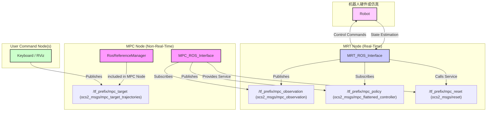

# ocs2_ros_interfaces 包分析

## 1. 功能与节点关系

### 1.1. 实现功能

`ocs2_ros_interfaces` 包是 OCS2 框架与 ROS (Robot Operating System) 生态系统之间的核心桥梁。它将 `ocs2_core` 和 `ocs2_mpc` 中定义的抽象 MPC 和 MRT 概念，封装成具体的、可以通过 ROS 话题和服务进行通信的节点。

这个包使得 OCS2 能够在一个典型的 ROS 系统中运行，实现了以下关键功能：
1.  **ROS 通信**: 将 MPC 的优化循环和 MRT 的实时控制循环分别封装成独立的 ROS 节点，它们通过 ROS 话题进行解耦和通信。
2.  **数据转换**: 提供了 OCS2 核心数据结构（如 `SystemObservation`, `PrimalSolution`, `TargetTrajectories`）与自定义的 ROS 消息（定义在 `ocs2_msgs` 包中）之间的双向转换。
3.  **用户指令接口**: 提供了多种通过 ROS 与 MPC 系统交互的方式，例如通过键盘输入、RViz 中的交互式标记 (Interactive Marker) 来发送目标指令。
4.  **在线参考更新**: 允许在运行时通过 ROS 话题动态更新 MPC 的目标轨迹和模式计划。
5.  **可视化与调试**: 提供了将 OCS2 内部数据（如规划轨迹、约束等）发布以便在 RViz 等工具中进行可视化的功能。

### 1.2. 节点关系

`ocs2_ros_interfaces` 的典型应用场景是一个多节点、多线程的 ROS 系统。核心是分离的 MPC 节点和 MRT 节点，此外还有一个或多个用户指令节点。

**文字表述节点关系:**

1.  **MRT 节点 (实时)**:
    *   这个节点通常运行在机器人本体的计算机上，或者与仿真环境直接交互。它包含一个 `MRT_ROS_Interface` 实例。
    *   它从机器人获取当前的**实际状态** (`SystemObservation`)。
    *   通过 ROS 话题 `/tf_prefix/mpc_observation` 将这个状态**发布**出去，通知 MPC 节点。
    *   它**订阅** `/tf_prefix/mpc_policy` 话题，以接收来自 MPC 节点的最新优化策略。
    *   在其实时循环中，它使用当前持有的最优策略计算控制指令，并发送给机器人执行器。
    *   它可以通过 ROS 服务 `/tf_prefix/mpc_reset` 来请求 MPC 节点重置。

2.  **MPC 节点 (非实时)**:
    *   这个节点负责计算密集型的优化任务，可以运行在机器人本体或一个独立的、性能更强的计算机上。它包含一个 `MPC_ROS_Interface` 实例。
    *   它**订阅** `/tf_prefix/mpc_observation` 话题来获取系统的当前状态，这会触发一次新的 MPC 优化。
    *   优化完成后，它将新的最优策略（`PrimalSolution`）打包成 `mpc_flattened_controller` 消息，并**发布**到 `/tf_prefix/mpc_policy` 话题。
    *   它内部通常还包含一个 `RosReferenceManager`，该管理器**订阅** `/tf_prefix/mpc_target` 话题，以接收并更新用户的目标指令。
    *   它提供 `/tf_prefix/mpc_reset` **服务**，允许 MRT 节点或其他外部节点重置其状态。

3.  **用户指令节点**:
    *   这是一个或多个独立的 ROS 节点，用于向 MPC 发送高级指令。
    *   例如，`TargetTrajectoriesKeyboardPublisher` 节点读取键盘输入，`TargetTrajectoriesInteractiveMarker` 节点使用 RViz 中的交互式标记。
    *   它们将用户输入转换成 `TargetTrajectories` 消息，并**发布**到 `/tf_prefix/mpc_target` 话题，最终被 MPC 节点的 `RosReferenceManager` 接收。

这个架构通过 ROS 话题将实时控制与非实时优化完全解耦，是 OCS2 框架在真实机器人上应用的基础。

---

## 2. 各节点方法功能说明

### 2.1. MPC_ROS_Interface

这是对 `ocs2_mpc::MPC_BASE` 的 ROS 封装，使其能够作为一个独立的 ROS 节点运行。

#### **核心方法**

*   **`MPC_ROS_Interface(MPC_BASE& mpc, ...)` (构造函数)**
    *   **功能**: 传入一个具体的 `MPC_BASE` 实例，并初始化 ROS 相关的设置。

*   **`void launchNodes(ros::NodeHandle& nodeHandle)`**
    *   **功能**: 启动该节点的所有 ROS 通信接口，包括：
        *   订阅 `_mpc_observation` 话题。
        *   发布 `_mpc_policy` 话题。
        *   提供 `_mpc_reset` 服务。

*   **`void mpcObservationCallback(...)` (回调函数)**
    *   **功能**: 这是该节点的核心回调。当收到新的 `mpc_observation` 消息时被触发。
    *   **流程**:
        1.  使用 `RosMsgConversions` 将 ROS 消息解析为 `SystemObservation` C++ 对象。
        2.  调用 `mpc_.run()`，传入当前时间和状态，启动一次 MPC 优化计算。
        3.  优化完成后，调用 `copyToBuffer()` 从求解器中提取出 `PrimalSolution` 等结果。
        4.  将结果打包成 `mpc_flattened_controller` 消息，并通过一个独立的发布线程发布出去。

*   **`void resetMpcNode(...)`**
    *   **功能**: 重置 MPC 求解器，并设置新的初始目标轨迹。

### 2.2. MRT_ROS_Interface

这是对 `ocs2_mpc::MRT_BASE` 的 ROS 封装，用于在实时节点中运行。

#### **核心方法**

*   **`MRT_ROS_Interface(std::string topicPrefix, ...)` (构造函数)**
    *   **功能**: 初始化 MRT 接口，设置 ROS 话题的前缀。

*   **`void launchNodes(ros::NodeHandle& nodeHandle)`**
    *   **功能**: 启动该节点的所有 ROS 通信接口，包括：
        *   发布 `_mpc_observation` 话题。
        *   订阅 `_mpc_policy` 话题。
        *   创建 `_mpc_reset` 服务的客户端。

*   **`void setCurrentObservation(const SystemObservation& currentObservation)`**
    *   **功能**: 将当前的系统状态通过 `_mpc_observation` 话题发布出去。这个方法通常在实时控制循环中被高频调用。

*   **`void mpcPolicyCallback(...)` (回调函数)**
    *   **功能**: 当从 `_mpc_policy` 话题收到新的策略时被触发。
    *   **流程**:
        1.  使用 `RosMsgConversions` 将 `mpc_flattened_controller` 消息解析为 `PrimalSolution`, `CommandData` 等 C++ 对象。
        2.  调用 `MRT_BASE::moveToBuffer()` 方法，将这些新策略安全地放入双缓冲区的后台缓冲区中。

*   **`void spinMRT()`**
    *   **功能**: 处理一次 MRT 节点的 ROS 回调队列。这被设计为非阻塞的，以保证实时性。

### 2.3. RosMsgConversions

这是一个命名空间，包含了一系列自由函数，是连接 OCS2 C++ 世界和 ROS 消息世界的关键。

*   **`createObservationMsg(const SystemObservation& observation)`**: 将 `SystemObservation` 对象转换为 `ocs2_msgs::mpc_observation` 消息。
*   **`readObservationMsg(const ocs2_msgs::mpc_observation& msg)`**: 将 ROS 消息解析回 `SystemObservation` 对象。
*   **类似 `create...` 和 `read...` 的函数对**: 为 `TargetTrajectories`, `ModeSchedule`, `PerformanceIndex` 等核心数据结构都提供了类似的双向转换函数。

### 2.4. Command (指令发布)

*   **`TargetTrajectoriesRosPublisher`**: 一个简单的类，封装了向 `_mpc_target` 话题发布 `TargetTrajectories` 消息的功能。
*   **`TargetTrajectoriesKeyboardPublisher`**: 监听键盘输入，将其转换为 `TargetTrajectories`，并使用 `TargetTrajectoriesRosPublisher` 发布。它需要一个用户定义的转换函数来将命令行向量映射到具体的目标状态。
*   **`TargetTrajectoriesInteractiveMarker`**: 在 RViz 中创建一个可以拖动的交互式标记。当用户操作标记后，它会获取标记的位姿，通过一个用户定义的转换函数将其转换为 `TargetTrajectories`，然后发布出去。

### 2.5. Synchronized Module (同步模块)

*   **`RosReferenceManager`**: 这是一个 `ReferenceManager` 的装饰器。它在内部持有一个 `ReferenceManager` 实例，并额外订阅了 `_mpc_target` 和 `_mode_schedule` 话题。当收到新消息时，它会自动调用内部实例的 `setTargetTrajectories` 或 `setModeSchedule` 方法，从而实现了目标指令的在线更新。
*   **`SolverObserverRosCallbacks`**: 提供了一系列工厂函数，用于创建可以发布求解器内部数据的 ROS 回调。例如，可以创建一个回调来实时监控某个约束的值，并将其发布到 ROS 话题上，方便调试和可视化。

---

## 3. 应当说明的内容

*   **ROS 话题命名约定**: 整个包遵循一个清晰的命名约定。几乎所有的 ROS 接口都围绕一个 `topicPrefix` 来构建。例如，如果 `topicPrefix` 是 `legged_robot`，那么相关的核心话题就是：
    *   `/legged_robot_mpc_observation`
    *   `/legged_robot_mpc_policy`
    *   `/legged_robot_mpc_target`
    这使得在同一个 ROS 网络中可以轻松地运行多个 OCS2 控制系统而不会相互干扰。

*   **线程模型**: `MPC_ROS_Interface` 和 `MRT_ROS_Interface` 都使用了独立的线程来处理 ROS 消息的发布，以避免阻塞主计算流程。特别是 `MRT_ROS_Interface`，它使用了自定义的 ROS 回调队列 (`mrtCallbackQueue_`)，并通过 `spinMRT()` 手动处理，这给予了实时循环对通信时机的精确控制，是保证实时性能的关键。

*   **解耦设计**: 这个包完美地体现了 OCS2 的核心设计哲学——解耦。它不仅将优化与控制解耦，还通过 ROS 将整个控制系统与用户界面、仿真/硬件接口、以及其他机器人模块（如感知、状态估计）彻底解耦。任何能够发布 `SystemObservation` 消息的模块都可以驱动 MPC，任何能够订阅 `mpc_flattened_controller` 消息的模块都可以利用其规划结果。
