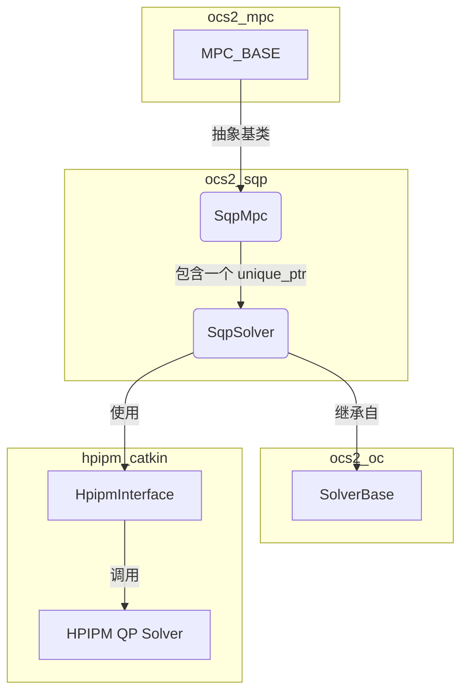

# ocs2_sqp 包分析

本文档旨在分析 `ocs2_sqp` 包的代码，梳理其功能、主要组件（节点）及其相互关系。

## 1. 功能说明

`ocs2_sqp` 包实现了一个用于求解 OCS2 定义的最优控制问题的求解器。该求解器基于**贯序二次规划（Sequential Quadratic Programming, SQP）** 和 **多重打靶（Multiple-Shooting）** 方法。

其核心思想是在每个迭代步中，将非线性的最优控制问题（OCP）线性化，构建一个二次规划（QP）子问题。然后，它调用底层的QP求解器（在此包中为 HPIPM）来求解这个子问题，从而得到下降方向。最后，通过线搜索（Linesearch）确定一个合适的步长来更新状态和控制轨迹，并不断迭代直至收敛。

该包主要依赖于 `hpipm_catkin` 和 `blasfeo_catkin`，它们分别是高性能QP求解器 HPIPM 及其底层线性代数库 BLASFEO 的 ROS Catkin 封装。

## 2. 节点关系

`ocs2_sqp` 包的核心是 `SqpSolver` 类，它被 `SqpMpc` 类封装以适配 OCS2 的 MPC 框架。它们与 `MPC_BASE` 的关系如下：

**文字表述节点关系:**

1.  `SqpMpc` 是一个面向用户的MPC接口类，它继承自 `ocs2_mpc` 包中的抽象基类 `MPC_BASE`。这使得 `SqpMpc` 可以无缝集成到 OCS2 的标准MPC框架中。
2.  `SqpMpc` 内部包含一个指向 `SqpSolver` 实例的智能指针 (`std::unique_ptr`)。`SqpMpc` 本身不实现复杂的求解逻辑，而是作为一个适配器，将 `MPC_BASE` 的接口调用（如 `calculateController`）转发给 `SqpSolver`。
3.  `SqpSolver` 是实际实现SQP算法的核心类，它继承自 `ocs2_oc` 中的 `SolverBase`。它负责管理SQP的迭代过程，包括构建QP子问题、调用QP求解器、执行线搜索和检查收敛性。
4.  `SqpSolver` 使用 `HpipmInterface` 对象来与底层的 HPIPM 求解器进行交互，从而求解QP子问题。

## 3. 节点功能详解

### SqpSolver 类

`SqpSolver` 是SQP算法的具体实现。

-   **`SqpSolver(settings, optimalControlProblem, initializer)` (构造函数)**
    -   接收SQP求解器的配置 (`sqp::Settings`)、最优控制问题定义 (`OptimalControlProblem`) 和初始化器 (`Initializer`)。
    -   根据配置选择动力学离散和敏感性离散的方法（如 Runge-Kutta）。
    -   初始化 HPIPM 接口和线程池。

-   **`runImpl(initTime, initState, finalTime)`**
    -   这是求解器的主入口函数，执行SQP迭代循环。
    -   **循环开始 (`while (convergence == sqp::Convergence::FALSE)`)**
        1.  **`setupQuadraticSubproblem(...)`**: 构建围绕当前轨迹（状态x, 输入u）的QP子问题。此步骤会计算动力学、成本和约束的线性或二次近似，即L-Q（Linear-Quadratic）近似。
        2.  **`getOCPSolution(...)`**: 调用 `hpipmInterface_` 来求解QP子问题，得到下降方向 `deltaXSol` 和 `deltaUSol`。
        3.  **`extractValueFunction(...)`**: (如果 `createValueFunction` 为 `true`) 从QP求解结果中提取值函数（Cost-to-Go）的二次近似。
        4.  **`takeStep(...)`**: 使用 `FilterLinesearch` 算法执行线搜索，找到一个合适的步长 `alpha`，使得成本和约束违反度都能得到可接受的改善。然后更新轨迹：`x_new = x + alpha * delta_x`, `u_new = u + alpha * delta_u`。
        5.  **`checkConvergence(...)`**: 检查是否满足收敛条件（例如，达到最大迭代次数、步长过小、性能指标改善低于阈值等）。
    -   **循环结束**
    -   **`toPrimalSolution(...)`**: 将最终的轨迹 `x` 和 `u` 以及（可选的）反馈增益 `K` 封装成 `PrimalSolution` 对象返回。

### SqpMpc 类

`SqpMpc` 是 `SqpSolver` 的MPC封装，使其能够作为标准的 OCS2 MPC 控制器使用。

-   **`SqpMpc(mpcSettings, settings, optimalControlProblem, initializer)` (构造函数)**
    -   调用基类 `MPC_BASE` 的构造函数，并创建一个 `SqpSolver` 的实例。

-   **`calculateController(initTime, initState, finalTime)`**
    -   此方法是 `MPC_BASE` 定义的纯虚函数的实现，是MPC循环的核心回调函数。
    -   它的实现非常直接：直接调用 `solverPtr_->run(initTime, initState, finalTime)`。
    -   当MPC框架需要计算新的最优控制序列时，就会调用此函数，从而触发 `SqpSolver` 运行其SQP迭代求解过程。

-   **与 `MPC_Base` 的关系**
    -   `MPC_Base` 定义了一个通用的MPC接口，它不关心底层的优化算法是什么。它只负责在每个控制周期调用 `calculateController` 方法。
    -   `SqpMpc` 通过继承 `MPC_Base` 并实现 `calculateController` 方法，将 `SqpSolver` "插入" 到MPC框架中。这是一种典型的**策略模式**或**模板方法模式**的应用，其中 `MPC_Base` 定义了算法的骨架，而 `SqpMpc` 提供了该骨架中特定步骤（即求解OCP）的具体实现。

### SqpSettings 结构体

这个结构体包含了配置SQP求解器行为的所有参数，例如：
-   `sqpIteration`: 最大SQP迭代次数。
-   `deltaTol`, `costTol`: 用于收敛判断的容忍度。
-   `alpha_decay`, `alpha_min`, `armijoFactor`: 线搜索相关参数。
-   `dt`: 离散化的时间步长。
-   `useFeedbackPolicy`: 是否计算并使用反馈控制器（否则为纯前馈）。
-   `projectStateInputEqualityConstraints`: 是否使用投影方法处理状态-输入等式约束。
-   `nThreads`: 并行计算的线程数。

## 4. 补充说明

-   **约束处理**: `SqpSolver` 提供了两种处理状态-输入等式约束（`Cx + Du + e = 0`）的方式，通过 `projectStateInputEqualityConstraints` 参数控制。
    1.  `false`: 将约束作为QP子问题的一部分，由HPIPM直接处理。
    2.  `true`: 使用投影方法，将输入 `u` 投影到满足约束的子空间中，从而将约束问题转化为一个无约束的QP子问题。这种方法可以减小QP问题的规模。`testCircularKinematics.cpp` 测试了这两种模式。
-   **日志与调试**: `SqpLogging` 提供了详细的日志功能，可以将每次迭代的耗时、性能指标、步长、收敛状态等信息记录到文件中。`logging/ReadSqpLog.py` 脚本可以用于可视化这些日志数据，极大地便利了算法的调试和性能分析。
-   **事件与切换系统**: `SqpSolver` 支持带事件的切换系统。如 `testSwitchedProblem.cpp` 所示，它能够正确处理在事件时刻（event time）的系统跳变（Jump Map）和模式切换，确保了在混合系统中的适用性。
