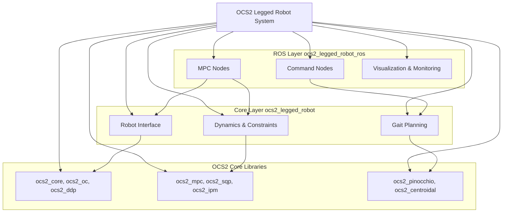
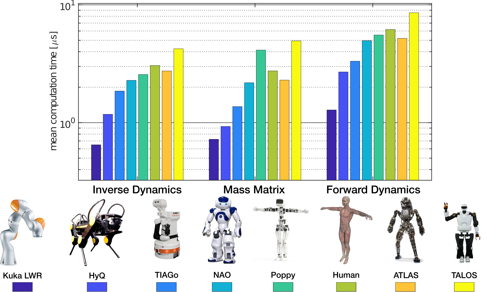
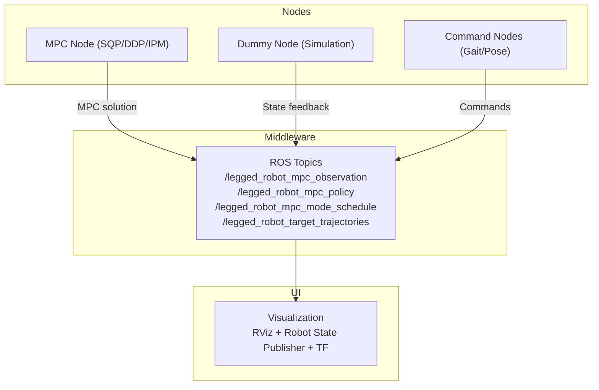

# OCS2 Legged Robot 系统架构分析文档

## 概述

OCS2 是一个用于最优控制问题的高效C++库，专门针对legged robot（足式机器人）提供了完整的模型预测控制（MPC）解决方案。系统由两个核心包组成：

- **ocs2_legged_robot**: 核心算法包，包含机器人模型、动力学、约束和MPC接口
- **ocs2_legged_robot_ros**: ROS接口包，提供节点、可视化和命令接口
- **xacro模型来源**: anymal.urdf（ ANYbotics 公司提供了一个开源版本，用于研究和社区用途）
ANYmal 是一款由瑞士公司 ANYbotics 开发的四足机器人。ANYbotics 公司是苏黎世联邦理工学院（ETH Zurich）的一个衍生公司，专注于为工业应用设计和制造四足机器人，特别是用于危险和复杂的环境（如油气、化工、能源和基础设施）的自主巡检和数据收集。  
相关链接: [官网](https://www.anybotics.com/robotics/anymal/)

## 1. 系统架构概览



## 2. 核心组件分析

### 2.1 ocs2_legged_robot 包

#### 核心类: LeggedRobotInterface
**位置**: `include/ocs2_legged_robot/LeggedRobotInterface.h`

这是整个系统的核心接口类，负责：
- 创建最优控制问题
- 配置MPC求解器设置
- 管理机器人动力学模型
- 初始化约束和代价函数

**主要接口与功能说明：**

- `LeggedRobotInterface(const std::string& taskFile, const std::string& urdfFile, const std::string& referenceFile, bool useHardFrictionConeConstraint = false);`
  - 构造函数。加载任务配置、URDF、参考文件，初始化模型、MPC参数、约束、代价、步态管理等。

- `const OptimalControlProblem& getOptimalControlProblem() const override;`
  - 获取最优控制问题对象，包含动力学、代价、约束等，供MPC/SLQ等求解器使用。

- `const ModelSettings& modelSettings() const;`
  - 获取机器人模型相关参数（如关节名、接触点名、步态切换时间等）。

- `const ddp::Settings& ddpSettings() const;`
  - 获取DDP（Differential Dynamic Programming）求解器参数。

- `const mpc::Settings& mpcSettings() const;`
  - 获取MPC（Model Predictive Control）求解器参数。

- `const rollout::Settings& rolloutSettings() const;`
  - 获取系统仿真/rollout相关参数。

- `const sqp::Settings& sqpSettings();`
  - 获取SQP（Sequential Quadratic Programming）求解器参数。

- `const ipm::Settings& ipmSettings();`
  - 获取IPM（Interior Point Method）求解器参数。

- `const vector_t& getInitialState() const;`
  - 获取机器人初始状态向量。

- `const RolloutBase& getRollout() const;`
  - 获取rollout对象，用于系统仿真和轨迹生成。

- `PinocchioInterface& getPinocchioInterface();`
  - 获取Pinocchio动力学建模接口，支持运动学/动力学计算。

- `const CentroidalModelInfo& getCentroidalModelInfo() const;`
  - 获取质心动力学模型信息（如状态/输入维度、接触点数量等）。

- `std::shared_ptr<SwitchedModelReferenceManager> getSwitchedModelReferenceManagerPtr() const;`
  - 获取步态/参考轨迹管理器，支持步态切换、轨迹生成。

- `const LeggedRobotInitializer& getInitializer() const override;`
  - 获取系统初始化器，用于MPC等算法的初始轨迹生成。

- `std::shared_ptr<ReferenceManagerInterface> getReferenceManagerPtr() const override;`
  - 获取通用参考管理器指针。

**主要私有方法（仅列举核心）：**

- `void setupOptimalConrolProblem(...)`：初始化最优控制问题，包括动力学、代价、约束、步态等。
- `std::shared_ptr<GaitSchedule> loadGaitSchedule(...)`：加载步态调度配置。
- `std::unique_ptr<StateInputCost> getBaseTrackingCost(...)`：生成基础跟踪代价项。
- `matrix_t initializeInputCostWeight(...)`：初始化输入代价权重矩阵。
- `std::pair<scalar_t, RelaxedBarrierPenalty::Config> loadFrictionConeSettings(...)`：加载摩擦锥约束参数。
- `std::unique_ptr<StateInputConstraint> getFrictionConeConstraint(...)`：生成摩擦锥硬约束。
- `std::unique_ptr<StateInputCost> getFrictionConeSoftConstraint(...)`：生成摩擦锥软约束。
- `std::unique_ptr<StateInputConstraint> getZeroForceConstraint(...)`：生成零力约束。
- `std::unique_ptr<StateInputConstraint> getZeroVelocityConstraint(...)`：生成足端零速度约束。
- `std::unique_ptr<StateInputConstraint> getNormalVelocityConstraint(...)`：生成足端法向速度约束。

#### 模型计算库: Pinocchio
Pinocchio: https://github.com/stack-of-tasks/pinocchio  
一个性能强大的C++模板库。  
Pinocchio功能多样，实现了基本和更高级的刚体动力学算法：
```txt
  正向运动学及其解析导数，
  正向/逆向动力学及其解析导数，
  质心动力学及其解析导数，
  用于系统识别等的运动学和动态回归量的计算，
  全面支持闭环机制，
  最先进的摩擦接触求解器，
  低复杂度约束铰接体算法，
  稀疏约束动力学及其解析导数，
  完全支持Python 和 C++ 中的多精度浮点（MPFR） ，
  支持现代开源自动微分框架，如CppAD或CasADi，
  可通过CppADCodeGen获得自动代码生成支持。
```

Pinocchio可以通过以下方式创建多体系统：
```txt
  URDF文件，
  SDF文件，
  MJCF 文件，
  SRDF 文件。
```

性能展示:


#### 模型设置: ModelSettings
**位置**: `include/ocs2_legged_robot/common/ModelSettings.h`

定义机器人的基本配置：

```cpp
struct ModelSettings {
  scalar_t positionErrorGain = 0.0;
  scalar_t phaseTransitionStanceTime = 0.4;
  
  // 关节名称（用于ANYmal机器人）
  std::vector<std::string> jointNames{
    "LF_HAA", "LF_HFE", "LF_KFE",  // 左前腿
    "RF_HAA", "RF_HFE", "RF_KFE",  // 右前腿  
    "LH_HAA", "LH_HFE", "LH_KFE",  // 左后腿
    "RH_HAA", "RH_HFE", "RH_KFE"   // 右后腿
  };
  
  // 接触点名称
  std::vector<std::string> contactNames3DoF{
    "LF_FOOT", "RF_FOOT", "LH_FOOT", "RH_FOOT"
  };
};
```

#### 参考管理器: SwitchedModelReferenceManager
**位置**: `include/ocs2_legged_robot/reference_manager/SwitchedModelReferenceManager.h`

管理步态切换和轨迹规划：

```cpp
class SwitchedModelReferenceManager : public ReferenceManager {
 public:
  SwitchedModelReferenceManager(
    std::shared_ptr<GaitSchedule> gaitSchedulePtr,
    std::shared_ptr<SwingTrajectoryPlanner> swingTrajectoryPtr);
  
  void setModeSchedule(const ModeSchedule& modeSchedule) override;
  contact_flag_t getContactFlags(scalar_t time) const;
  // ...
};
```

### 2.2 ocs2_legged_robot_ros 包

#### 主要ROS节点

1. **MPC控制节点** (3种求解器):
   - `LeggedRobotSqpMpcNode.cpp` - SQP求解器
   - `LeggedRobotDdpMpcNode.cpp` - DDP求解器  
   - `LeggedRobotIpmMpcNode.cpp` - IPM求解器

**SQP MPC节点核心代码**:
```cpp
int main(int argc, char** argv) {
  const std::string robotName = "legged_robot";
  
  // 初始化ROS节点
  ::ros::init(argc, argv, robotName + "_mpc");
  ::ros::NodeHandle nodeHandle;
  
  // 获取配置文件路径
  std::string taskFile, urdfFile, referenceFile;
  nodeHandle.getParam("/taskFile", taskFile);
  nodeHandle.getParam("/urdfFile", urdfFile);
  nodeHandle.getParam("/referenceFile", referenceFile);

  // 创建机器人接口
  LeggedRobotInterface interface(taskFile, urdfFile, referenceFile);

  // 步态接收器
  auto gaitReceiverPtr = std::make_shared<GaitReceiver>(
    nodeHandle, 
    interface.getSwitchedModelReferenceManagerPtr()->getGaitSchedule(), 
    robotName);

  // ROS参考管理器
  auto rosReferenceManagerPtr = std::make_shared<RosReferenceManager>(
    robotName, interface.getReferenceManagerPtr());
  rosReferenceManagerPtr->subscribe(nodeHandle);

  // 创建MPC求解器
  SqpMpc mpc(interface.mpcSettings(), interface.sqpSettings(), 
             interface.getOptimalControlProblem(), interface.getInitializer());
  mpc.getSolverPtr()->setReferenceManager(rosReferenceManagerPtr);
  mpc.getSolverPtr()->addSynchronizedModule(gaitReceiverPtr);

  // 启动MPC ROS接口
  MPC_ROS_Interface mpcNode(mpc, robotName);
  mpcNode.launchNodes(nodeHandle);

  return 0;
}
```

2. **仿真节点**:
   - `LeggedRobotDummyNode.cpp` - 虚拟机器人仿真

3. **命令节点**:
   - `LeggedRobotGaitCommandNode.cpp` - 步态命令
   - `LeggedRobotPoseCommandNode.cpp` - 位姿命令

#### 步态接收器: GaitReceiver
**位置**: `include/ocs2_legged_robot_ros/gait/GaitReceiver.h`

```cpp
class GaitReceiver : public SolverSynchronizedModule {
 public:
  GaitReceiver(::ros::NodeHandle nodeHandle, 
               std::shared_ptr<GaitSchedule> gaitSchedulePtr, 
               const std::string& robotName);

  void preSolverRun(scalar_t initTime, scalar_t finalTime, 
                    const vector_t& currentState,
                    const ReferenceManagerInterface& referenceManager) override;

 private:
  void mpcModeSequenceCallback(const ocs2_msgs::mode_schedule::ConstPtr& msg);
  // ...
};
```

#### 可视化器: LeggedRobotVisualizer
**位置**: `include/ocs2_legged_robot_ros/visualization/LeggedRobotVisualizer.h`

提供RViz可视化功能：
- 机器人状态显示
- 足端轨迹
- 接触力可视化
- 支撑多边形显示

## 3. 节点交互关系



## 4. 关键配置文件

### 4.1 MPC配置 (`config/mpc/task.info`)

```ini
centroidalModelType             1  // Single Rigid Body Dynamics

legged_robot_interface
{
  verbose                               false
  useAnalyticalGradientsDynamics        false
  useAnalyticalGradientsConstraints     false
}

model_settings
{
  positionErrorGain             0.0
  phaseTransitionStanceTime     0.4
  verboseCppAd                  true
  recompileLibrariesCppAd       true
  modelFolderCppAd              /tmp/ocs2
}

swing_trajectory_config
{
  liftOffVelocity               0.2
  touchDownVelocity            -0.4
  swingHeight                   0.1
  touchdownAfterHorizon         0.2
  swingTimeScale                0.15
}

sqp
{
  nThreads                              3
  dt                                    0.015
  sqpIteration                          1
  deltaTol                              1e-4
  // ... 更多SQP设置
}
```

### 4.2 步态配置 (`config/command/gait.info`)

```ini
list
{
  [0] stance      // 静立
  [1] trot        // 小跑
  [2] standing_trot
  [3] flying_trot
  [4] pace        // 溜蹄
  [5] static_walk // 静态行走
  // ... 更多步态
}

trot
{
  modeSequence
  {
    [0]     LF_RH    // 左前右后腿接触
    [1]     RF_LH    // 右前左后腿接触  
  }
  switchingTimes
  {
    [0]     0.0
    [1]     0.35
    [2]     0.70
  }
}
```

## 5. 启动文件分析

### 主启动文件 (`launch/legged_robot_sqp.launch`)

```xml
<launch>
    <!-- 配置参数 -->
    <arg name="taskFile"          default="$(find ocs2_legged_robot)/config/mpc/task.info"/>
    <arg name="referenceFile"     default="$(find ocs2_legged_robot)/config/command/reference.info"/>
    <arg name="urdfFile"          default="$(find ocs2_robotic_assets)/resources/anymal_c/urdf/anymal.urdf"/>
    <arg name="gaitCommandFile"   default="$(find ocs2_legged_robot)/config/command/gait.info"/>

    <!-- RViz可视化 -->
    <group if="$(arg rviz)">
      <param name="legged_robot_description" textfile="$(arg urdfFile)"/>
      <node pkg="rviz" type="rviz" name="rviz" args="-d $(arg rvizconfig)" output="screen" />
    </group>

    <!-- 核心节点 -->
    <node pkg="ocs2_legged_robot_ros" type="legged_robot_sqp_mpc" name="legged_robot_sqp_mpc"/>
    <node pkg="ocs2_legged_robot_ros" type="legged_robot_dummy" name="legged_robot_dummy"/>
    <node pkg="ocs2_legged_robot_ros" type="legged_robot_target" name="legged_robot_target"/>
    <node pkg="ocs2_legged_robot_ros" type="legged_robot_gait_command" name="legged_robot_gait_command"/>
</launch>
```

## 6. 如何适配新机器人

### 6.1 机器人模型修改

1. **创建新的URDF文件**
   - 定义机器人的关节结构
   - 指定接触点（足端）链接名称
   - 设置质量和惯性参数

2. **修改 ModelSettings**
   
   在 `ModelSettings.h` 中修改：
   ```cpp
   struct ModelSettings {
     // 根据新机器人修改关节名称
     std::vector<std::string> jointNames{
       "joint1", "joint2", "joint3",  // 腿1
       "joint4", "joint5", "joint6",  // 腿2
       // ... 根据机器人自由度调整
     };
     
     // 修改接触点名称
     std::vector<std::string> contactNames3DoF{
       "foot1", "foot2", "foot3", "foot4"  // 根据足数调整
     };
   };
   ```

3. **调整配置文件**

   修改 `task.info` 中的机器人特定参数：
   ```ini
   model_settings
   {
     positionErrorGain             [根据机器人调整]
     phaseTransitionStanceTime     [根据步态调整]
   }
   
   swing_trajectory_config
   {
     liftOffVelocity               [根据机器人能力调整]
     touchDownVelocity            [根据机器人能力调整]  
     swingHeight                   [根据腿长调整]
   }
   ```

### 6.2 步态模式调整

修改 `gait.info` 以适应新机器人的腿数和步态：

```ini
# 对于六足机器人
tripod
{
  modeSequence
  {
    [0]     L1_R2_L3    // 左1右2左3腿接触
    [1]     R1_L2_R3    // 右1左2右3腿接触
  }
  switchingTimes
  {
    [0]     0.0
    [1]     0.25
    [2]     0.50
  }
}
```

### 6.3 启动文件修改

创建新的启动文件：
```xml
<launch>
    <!-- 使用新机器人的URDF -->
    <arg name="urdfFile" default="$(find your_robot_description)/urdf/your_robot.urdf"/>
    
    <!-- 使用新机器人的配置 -->
    <arg name="taskFile" default="$(find ocs2_legged_robot)/config/mpc/your_robot_task.info"/>
    <arg name="gaitCommandFile" default="$(find ocs2_legged_robot)/config/command/your_robot_gait.info"/>
    
    <!-- 其余保持不变 -->
</launch>
```

### 6.4 代码级别的修改

1. **如果腿数不同，需要修改**：
   - `CentroidalModelInfo` 中的 `numThreeDofContacts`
   - 约束生成逻辑中的循环次数
   - 可视化代码中的足端数量

2. **如果关节数不同，需要调整**：
   - 状态向量维度
   - 输入向量维度  
   - 初始化代码

## 7. 总结

OCS2 legged robot系统提供了完整的足式机器人MPC控制框架：

- **模块化设计**: 核心算法与ROS接口分离
- **多求解器支持**: SQP、DDP、IPM三种MPC求解器
- **灵活的步态管理**: 支持多种预定义步态和动态切换
- **完整的可视化**: RViz集成和实时监控
- **易于扩展**: 清晰的接口设计便于适配新机器人

通过修改配置文件、URDF模型和必要的代码调整，可以将系统适配到不同类型的足式机器人上。
