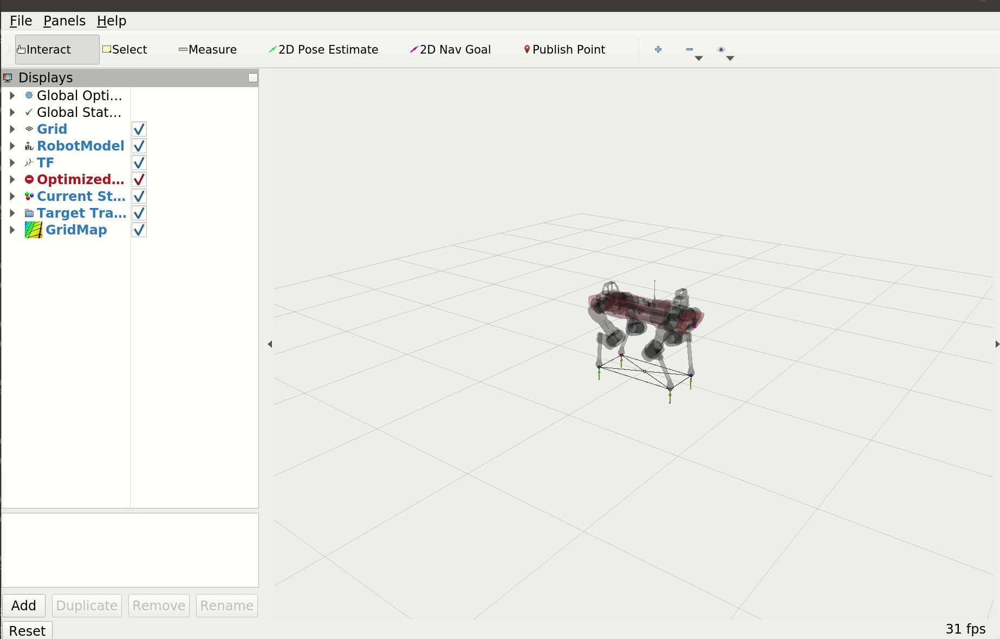

# ocs2_legged_robot start
## clone
```bash
# ubuntu20.04
# ros: noetic
mkdir -p ~/noetic_ws/src 
cd ~/noetic_ws/src
git clone https://github.com/qiayuanl/legged_control.git

# Clone OCS2
git clone https://github.com/leggedrobotics/ocs2.git
# Clone pinocchio
git clone --recurse-submodules https://github.com/leggedrobotics/pinocchio.git
# Clone hpp-fcl
git clone --recurse-submodules https://github.com/leggedrobotics/hpp-fcl.git
# Clone ocs2_robotic_assets
git clone https://github.com/leggedrobotics/ocs2_robotic_assets.git
# Install dependencies
sudo apt install liburdfdom-dev liboctomap-dev libassimp-dev
```

## build
```bash
# Build the example
catkin build ocs2_legged_robot_ros
```

## start
```bash
# Launch the example for DDP
roslaunch ocs2_legged_robot_ros legged_robot_ddp.launch
# OR launch the example for SQP
roslaunch ocs2_legged_robot_ros legged_robot_sqp.launch
```

demo

