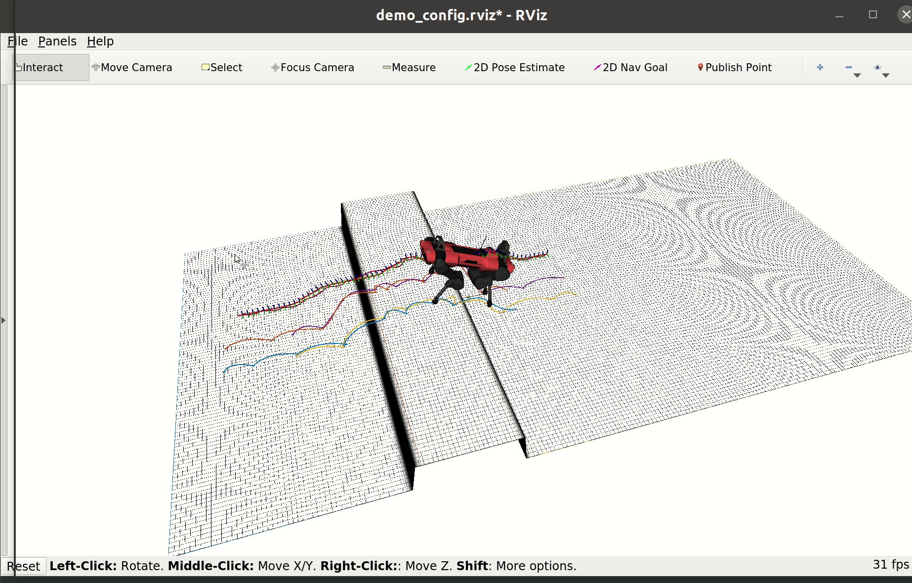
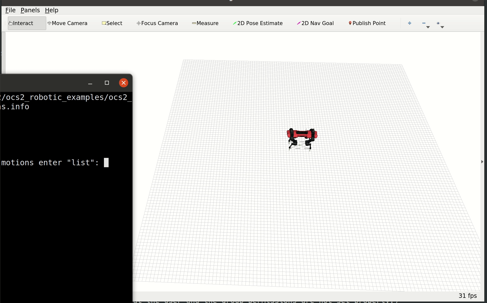

# ocs2_perceptive_anymal start
## build
依赖
```bash
sudo apt install python3-catkin-tools
sudo apt install libglpk-dev libmpfr-dev libgmp-dev liboctomap-dev libassimp-dev liburdfdom-dev
sudo apt install ros-noetic-pybind11-catkin ros-noetic-rqt-multiplot ros-noetic-octomap-msgs
```
源码
```
git clone https://github.com/leggedrobotics/ocs2.git
git clone https://github.com/leggedrobotics/ocs2_robotic_assets.git
git clone https://github.com/leggedrobotics/elevation_mapping_cupy.git
git clone https://github.com/leggedrobotics/grid_map.git
git clone --recurse-submodules https://github.com/leggedrobotics/pinocchio.git
git clone --recurse-submodules https://github.com/leggedrobotics/hpp-fcl.git
```
编译
```bash
catkin build ocs2_anymal -j4
```

## start
```bash
# 平面行走
roslaunch ocs2_anymal_loopshaping_mpc anymal_c.launch

# 感知Demo
roslaunch ocs2_anymal_loopshaping_mpc perceptive_mpc_demo.launch

# 离线Motion
roslaunch ocs2_anymal_mpc mpc.launch robot_name:=anymal_c config_name:=c_series
```

demo1


demo2
